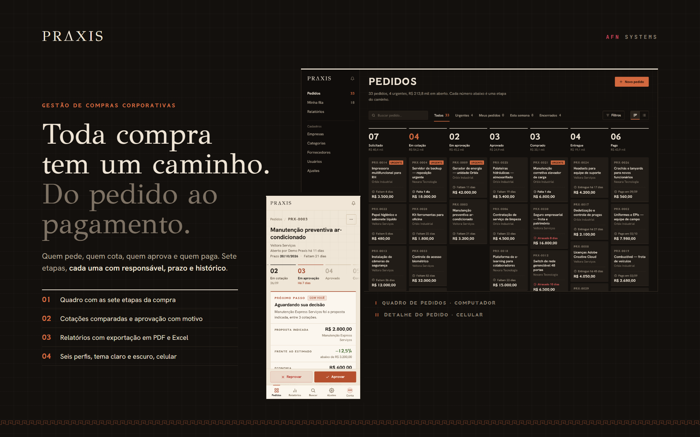
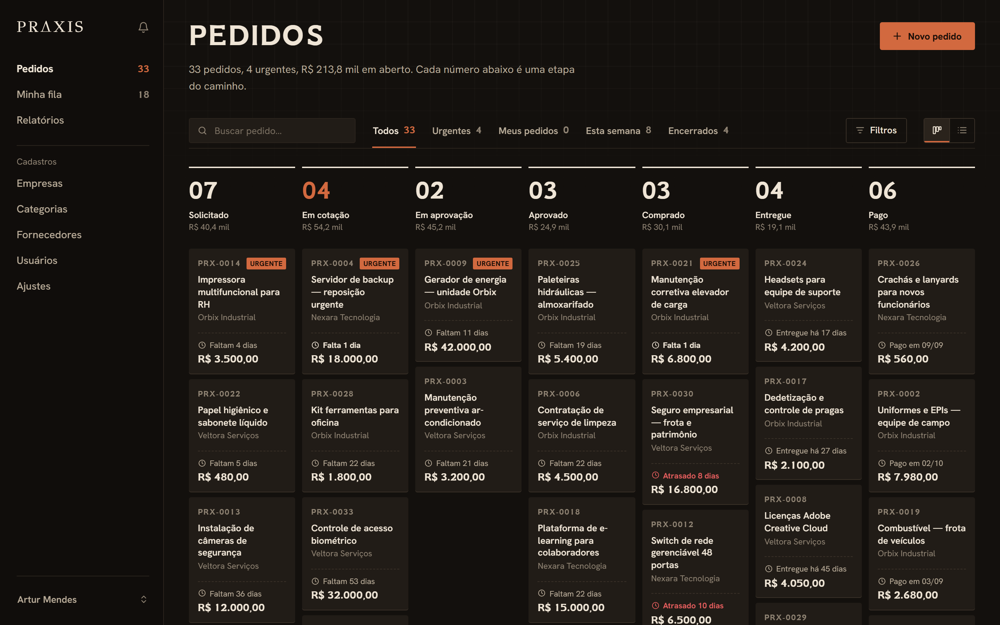
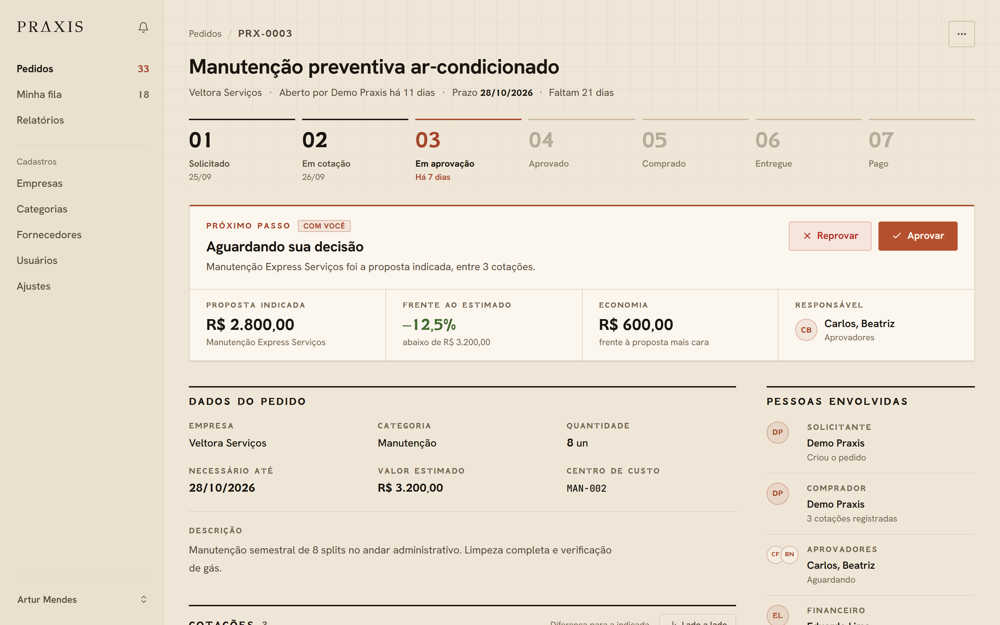
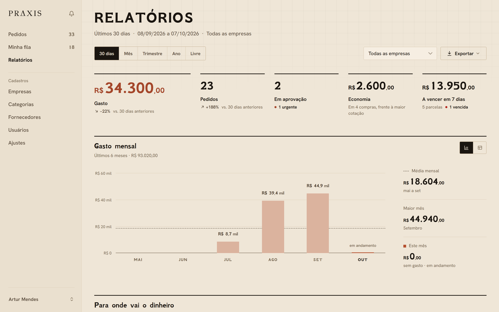
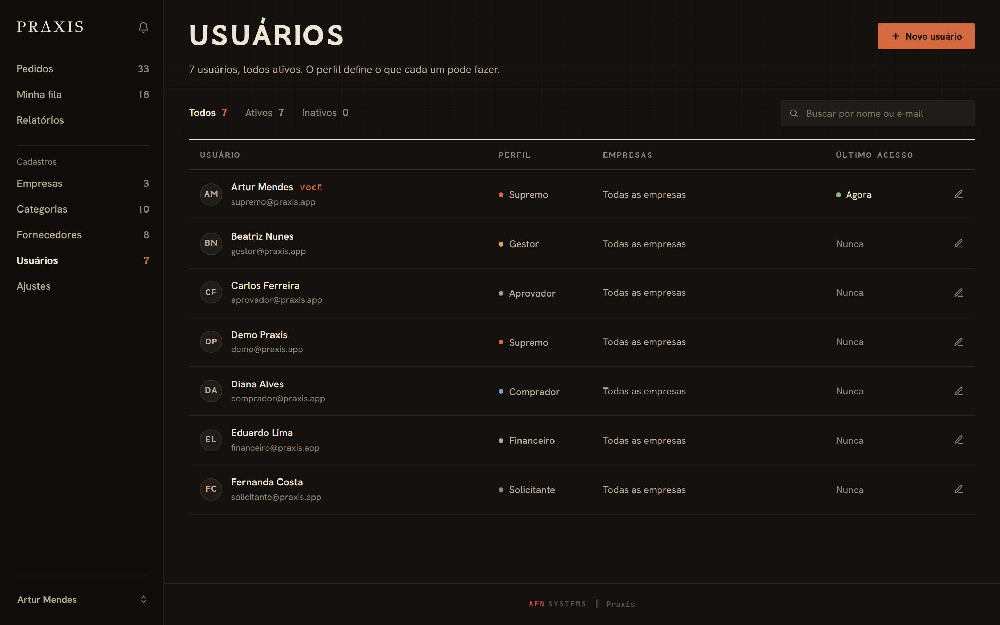
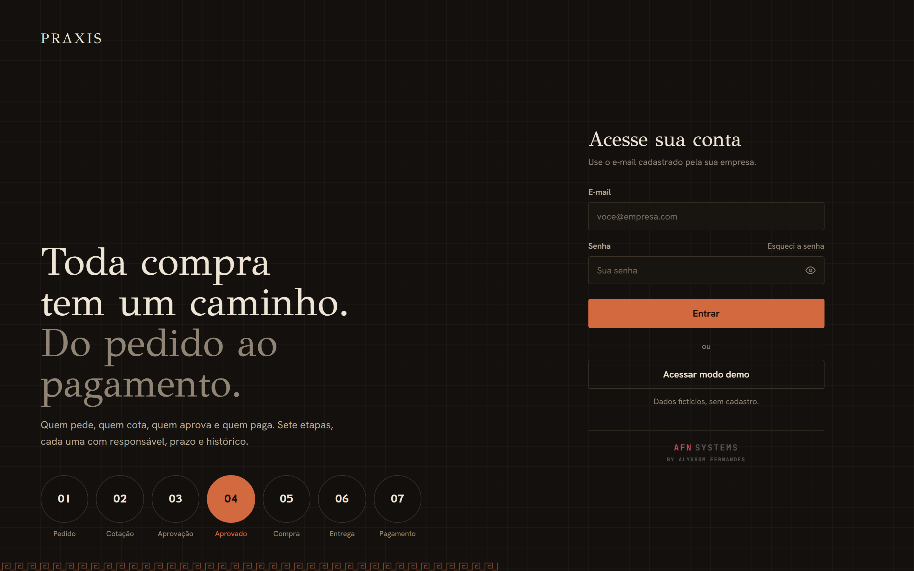
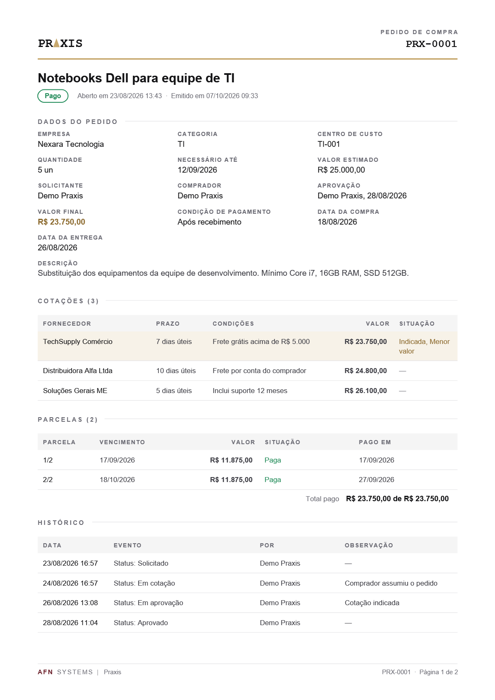
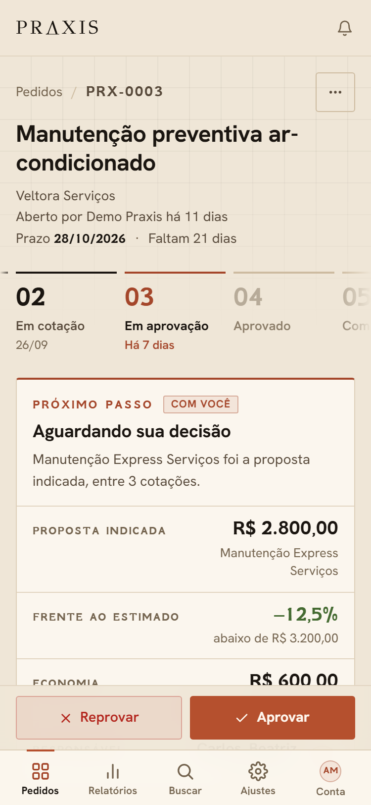
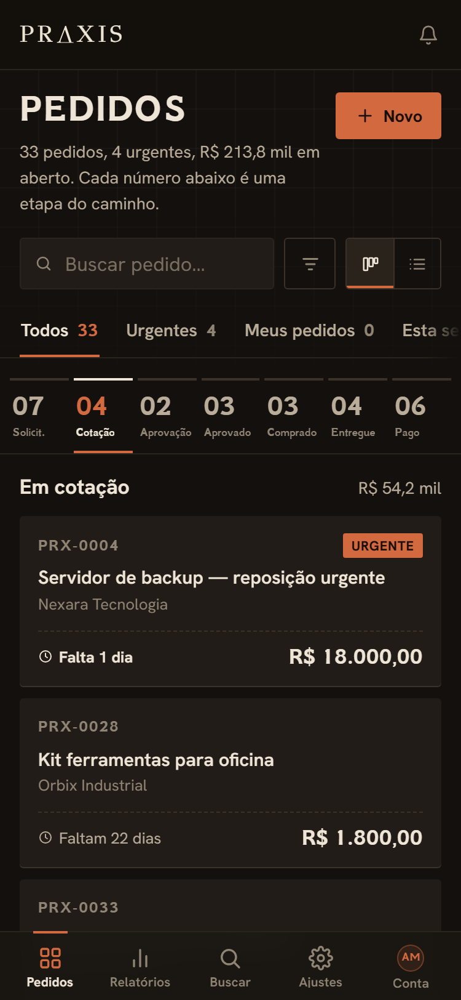
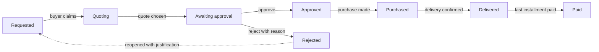

# Praxis



Praxis runs the purchasing of a group of companies, from request to payment.
Someone opens a request, a buyer gathers supplier quotes, an approver decides,
the purchase is made, delivery is confirmed and finance pays the installments.
Every step has an owner, a deadline and a history, and each role sees only what
belongs to it.

**Live demo:** [praxis-af618.web.app](https://praxis-af618.web.app). On the sign-in screen, click **Explorar a demonstração** (explore the demo).


This README is also available in [Portuguese](README.pt-br.md). The interface is in Brazilian Portuguese.

## In 30 seconds

1. Open the [demo](https://praxis-af618.web.app) and click **Explorar a demonstração**.
   You sign in as the administrator of three fictitious companies, with 33 orders spread across every stage.
2. On the board, open **PRX-0003** (awaiting approval): compare the three quotes and approve, or reject with a reason.
3. Open **PRX-0012** (purchased): its first installment is overdue. Record the payment and watch the order move on.
4. In **Relatórios** (reports), change the period and export to PDF or Excel, or print it.
5. Play around freely: the demo data resets every Sunday.

## Screens

Captured from the demo.

| Request board, dark theme | Order detail, light theme |
|---|---|
|  |  |
| **Reports, light theme** | **Users and roles, dark theme** |
|  |  |
| **Sign-in** | **The order as a PDF** |
|  |  |

| On a phone, light theme | On a phone, dark theme |
|---|---|
|  |  |

---

## Features

- **Board and list.** Kanban with the seven stages, a total per column, a deadline on every card and role-aware drag and drop. The list has filters, sorting, pagination and bulk selection (export to CSV or cancel with a reason).
- **Quotes.** Several proposals per order, a side-by-side comparison with the difference to the lowest one, the chosen quote flagged, and a supplier registry that never duplicates names.
- **Traceable approval.** Approve, or reject with a reason; a rejected order can be reopened with a justification, creating a new order linked to the original.
- **Purchase, delivery and installments.** The purchase records supplier, final amount and installments; each installment is paid with an attached receipt; the last one closes the order.
- **The next step is always visible.** Each order says who needs to act and what is missing, with the time spent in each stage and the bottleneck highlighted.
- **Comments with @mentions, attachments and a full history** in a single timeline.
- **Reports.** Spend, orders, savings from quotes and installments due, compared with the previous period; charts by month, status, category and company; PDF and Excel export plus a print layout. Approvers see operational data only.
- **Six roles** (supremo, gestor, aprovador, comprador, financeiro, solicitante), with permissions enforced on the server by Firestore rules and custom claims. Matrix in [`docs/permissoes.md`](docs/permissoes.md).
- **Multiple companies.** Each user sees only the companies they belong to; the top role sees all of them.
- **Real-time in-app notifications**; email through Resend once an API key is configured.
- **Command palette** (Ctrl+K), guided tour, installable PWA, light and dark themes and a dedicated phone layout.
- **Demo mode** with fictitious data whose dates follow today's date, rebuilt every week.

## How an order moves



Any order can be cancelled, with a reason, until it is purchased. The rules for each transition are in [`docs/fluxo-pedidos.md`](docs/fluxo-pedidos.md).

## Technical decisions

- **No framework and no build step.** The browser loads ES Modules directly; the whole interface comes from a CSS token system with light and dark themes.
- **Security on the server, not in the UI.** Each user's role and companies travel in the auth token (custom claims set by a Cloud Function) and Firestore rules check every read and write.
- **No races between users.** Claiming an order and approving it use `runTransaction`: if two people click at once, only one wins.
- **A demo that never gets stale.** The seed stores the date it was written for and shifts every date to today on each rebuild.
- **Everything verifiable locally.** With the Firebase emulators the whole app runs on your machine without touching real data.

More in [`docs/arquitetura.md`](docs/arquitetura.md).

## Running it

### Locally, with the emulators (no Firebase account needed)

Requirements: Node.js 20+ and Java 11+ (for the Firestore emulator).

```bash
npm install
cd functions && npm install && cd ..
cp js/config.example.js js/config.js   # the sample values already work with the emulators
npm run emuladores                     # keep it running
```

In another terminal:

```bash
npm run seed      # 33 orders, 3 companies and one account per role
npm run servir    # the app is served at http://localhost:8123
```

On `localhost` the app connects to the emulators by itself. Use **Explorar a demonstração**, or sign in as
`supremo@`, `gestor@`, `aprovador@`, `comprador@`, `financeiro@` or `solicitante@praxis.app`, all with the
password `demo1234`, to see the system through each role.

### On your own Firebase project

1. Create a project with Firestore, Authentication (email and password), Storage and Cloud Functions.
2. Fill `js/config.js` with the project keys and update `.firebaserc`.
3. `npx firebase deploy`. The rules (`firestore.rules`, `storage.rules`) and indexes are in the repository.

## Structure

```
index.html            single entry point; loads js/app.js as a module
css/                  tokens → base → components → views → themes
js/
  app.js              session, routes (?tela=), top bar, navigation
  pedidos.js          board and list, filters, saved views, bulk actions
  pedido-detalhe.js   order flow, quotes, installments, comments, attachments, PDF
  relatorios.js       dashboard, charts and exports
  config-*.js         users, registries and preferences
functions/            triggers, scheduled jobs and the demo seed
docs/                 architecture, order flow and permissions (in Portuguese)
```

## License

MIT. See [`LICENSE`](LICENSE).

---

**AFN SYSTEMS** · by Alyssom Fernandes
