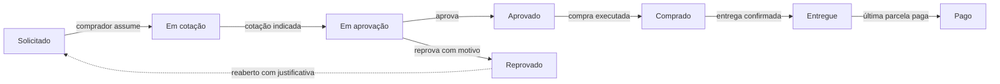

# Praxis


O Praxis organiza as compras de um grupo de empresas, do pedido ao pagamento.
Alguém abre uma solicitação, o comprador reúne as cotações, o aprovador decide,
a compra é feita, a entrega é confirmada e o financeiro paga as parcelas. Cada
etapa tem responsável, prazo e histórico, e cada perfil vê só o que lhe cabe.

**Demonstração ao vivo:** [praxis-af618.web.app](https://praxis-af618.web.app). Na entrada, clique em **Explorar a demonstração**.


Este README também está em [inglês](README.md).

## Em 30 segundos

1. Abra a [demonstração](https://praxis-af618.web.app) e clique em **Explorar a demonstração**.
   Você entra como administrador de três empresas fictícias, com 33 pedidos espalhados por todas as etapas.
2. No quadro, abra o **PRX-0003** (em aprovação): compare as três cotações e aprove ou reprove com motivo.
3. Abra o **PRX-0012** (comprado): a primeira parcela está vencida. Registre o pagamento e veja o pedido avançar.
4. Em **Relatórios**, troque o período e exporte em PDF ou Excel, ou mande imprimir.
5. Mexa à vontade: os dados de demonstração voltam ao original todo domingo.

## Telas

Capturadas do modo demonstração.

| Quadro de pedidos, tema escuro | Detalhe do pedido, tema claro |
|---|---|
|  |  |
| **Relatórios, tema claro** | **Usuários e perfis, tema escuro** |
|  |  |
| **Entrada** | **O pedido em PDF** |
|  |  |

| No celular, tema claro | No celular, tema escuro |
|---|---|
|  |  |

---

## Funcionalidades

- **Quadro e lista.** Kanban com as sete etapas, total em reais por coluna, prazo em cada cartão e arrastar e soltar conforme o perfil. Na lista, filtros, ordenação, paginação e seleção em massa (exportar CSV ou cancelar com motivo).
- **Cotações.** Várias propostas por pedido, comparação lado a lado com a diferença para a menor, indicação da escolhida e cadastro de fornecedores sem duplicar nomes.
- **Aprovação rastreável.** Aprovar ou reprovar com motivo; pedido reprovado pode ser reaberto com justificativa, gerando um novo pedido vinculado ao original.
- **Compra, entrega e parcelas.** Execução da compra com fornecedor, valor final e parcelas; pagamento parcela a parcela com comprovante; a última parcela fecha o pedido.
- **Próximo passo sempre à vista.** Cada pedido diz quem precisa agir e o que falta, com o tempo gasto em cada etapa e o gargalo destacado.
- **Comentários com @menção, anexos e histórico completo** em uma linha do tempo única.
- **Relatórios.** Gasto, pedidos, economia nas cotações e parcelas a vencer, com comparação ao período anterior; gráficos por mês, status, categoria e empresa; exportação em PDF e Excel e versão para impressão. O aprovador vê só os dados operacionais.
- **Seis perfis** (supremo, gestor, aprovador, comprador, financeiro e solicitante), com as permissões validadas no servidor pelas regras do Firestore e por *custom claims*. Matriz em [`docs/permissoes.md`](docs/permissoes.md).
- **Várias empresas.** Cada usuário enxerga só as empresas às quais pertence; o supremo vê todas.
- **Notificações em tempo real** no app; envio por e-mail via Resend quando a chave é configurada.
- **Paleta de comandos** (Ctrl+K), tour guiado, PWA instalável, tema claro e escuro e layout próprio para o celular.
- **Modo demonstração** com dados fictícios cujas datas acompanham o dia de hoje, recriados toda semana.

## Como um pedido anda



Qualquer pedido pode ser cancelado, com motivo, até ser comprado. As regras de cada transição estão em [`docs/fluxo-pedidos.md`](docs/fluxo-pedidos.md).

## Decisões técnicas

- **Sem framework e sem etapa de build.** O navegador carrega os ES Modules direto; a interface inteira sai de um sistema de *tokens* em CSS, com tema claro e escuro.
- **Segurança no servidor, não na tela.** O perfil e as empresas de cada usuário viajam no token (*custom claims*, definidos por uma Cloud Function) e as regras do Firestore conferem cada leitura e escrita.
- **Sem corrida entre usuários.** Assumir um pedido e aprovar usam `runTransaction`: se duas pessoas clicam juntas, só uma vence.
- **Demonstração que não envelhece.** O seed guarda a data para a qual foi escrito e desloca todas as datas até o dia de hoje a cada recriação.
- **Tudo verificável localmente.** Com os emuladores do Firebase, o app roda inteiro na máquina, sem tocar em dados reais.

Mais detalhes em [`docs/arquitetura.md`](docs/arquitetura.md).

## Como rodar

### Localmente, com os emuladores (sem conta no Firebase)

Requisitos: Node.js 20 ou superior e Java 11 ou superior (para o emulador do Firestore).

```bash
npm install
cd functions && npm install && cd ..
cp js/config.example.js js/config.js   # os valores de exemplo já servem para os emuladores
npm run emuladores                     # deixe rodando
```

Em outro terminal:

```bash
npm run seed      # 33 pedidos, 3 empresas e uma conta por perfil
npm run servir    # o app fica em http://localhost:8123
```

Em `localhost` o app se conecta sozinho aos emuladores. Na entrada, use **Explorar a demonstração**
ou entre com `supremo@`, `gestor@`, `aprovador@`, `comprador@`, `financeiro@` ou `solicitante@praxis.app`,
todos com a senha `demo1234`, para ver o sistema por cada perfil.

### No seu projeto Firebase

1. Crie um projeto com Firestore, Authentication (e-mail e senha), Storage e Cloud Functions.
2. Preencha `js/config.js` com as chaves do projeto e ajuste `.firebaserc`.
3. `npx firebase deploy`. As regras (`firestore.rules`, `storage.rules`) e os índices estão no repositório.

## Estrutura

```
index.html            entrada única; carrega js/app.js como módulo
css/                  tokens → base → componentes → telas → temas
js/
  app.js              sessão, rotas (?tela=), topbar, navegação
  pedidos.js          quadro e lista, filtros, visões salvas, ações em massa
  pedido-detalhe.js   fluxo do pedido, cotações, parcelas, comentários, anexos, PDF
  relatorios.js       painel, gráficos e exportações
  config-*.js         usuários, cadastros e preferências
functions/            gatilhos, rotinas agendadas e o seed da demonstração
docs/                 arquitetura, fluxo de pedidos e permissões
```

## Licença

MIT. Veja [`LICENSE`](LICENSE).

---

**AFN SYSTEMS** · por Alyssom Fernandes
